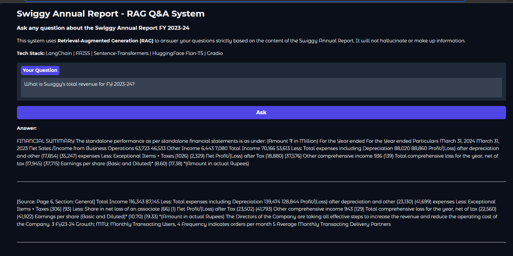

# Swiggy Annual Report RAG Q&A System

## Overview

This project implements a Retrieval-Augmented Generation (RAG) system that allows users to ask natural language questions about the **Swiggy Annual Report FY 2023–24**.

Instead of relying only on a language model, the system retrieves relevant sections from the document and generates answers based strictly on those sections. This ensures responses are grounded in the report and reduces hallucination.

The application supports both a **web interface (Gradio)** and a **command line interface** for querying the document.

---
## Features

- Query the Swiggy annual report using natural language questions  
- Answers generated only from the document content  
- Semantic search using vector embeddings  
- Displays supporting source text for transparency  
- Web UI and CLI interface available  
- Fully local setup with no external API keys required

## Application Interface



## Architecture

```
┌────────────────────────────────────────────────────────────────┐
│                     USER QUERY                                  │
│              "What is Swiggy's revenue?"                        │
└──────────────────────┬─────────────────────────────────────────┘
                       │
                       ▼
┌──────────────────────────────────────────────────────────────────┐
│  1. DOCUMENT PROCESSING                                          │
│  ┌──────────┐   ┌──────────┐   ┌──────────┐   ┌──────────────┐ │
│  │ PDF Load │──▶│ Extract  │──▶│  Clean   │──▶│   Chunk +    │ │
│  │(pdfplumber│  │  Text    │   │  Text    │   │  Metadata    │ │
│  │+ PyPDF2) │   └──────────┘   └──────────┘   └──────┬───────┘ │
│  └──────────┘                                         │         │
└───────────────────────────────────────────────────────┼─────────┘
                                                        │
                                                        ▼
┌──────────────────────────────────────────────────────────────────┐
│  2. EMBEDDING & VECTOR STORE                                     │
│  ┌───────────────────┐         ┌─────────────────────────┐      │
│  │ sentence-          │         │    FAISS Vector Store    │      │
│  │ transformers       │────────▶│  (Semantic Similarity   │      │
│  │ all-MiniLM-L6-v2  │         │       Search)           │      │
│  └───────────────────┘         └────────────┬────────────┘      │
└─────────────────────────────────────────────┼───────────────────┘
                                              │
                                              ▼
┌──────────────────────────────────────────────────────────────────┐
│  3. RAG ENGINE                                                   │
│  ┌──────────────┐   ┌────────────────┐   ┌──────────────────┐   │
│  │  Retrieve    │──▶│  Build Prompt  │──▶│  Generate Answer │   │
│  │  Top-K Chunks│   │  with Context  │   │  (Flan-T5-Base)  │   │
│  └──────────────┘   └────────────────┘   └────────┬─────────┘   │
└───────────────────────────────────────────────────┼─────────────┘
                                                    │
                                                    ▼
┌──────────────────────────────────────────────────────────────────┐
│  4. USER INTERFACE                                               │
│  ┌────────────────┐         ┌────────────────────┐              │
│  │  Gradio Web UI │         │   CLI Interface    │              │
│  │  (port 7860)   │         │   (Terminal)       │              │
│  └────────────────┘         └────────────────────┘              │
│                                                                  │
│  Output: Answer + Supporting Source Chunks                       │
└──────────────────────────────────────────────────────────────────┘
```

---

## Tech Stack

| Component | Technology | Purpose |
|-----------|-----------|---------|
| **PDF Processing** | pdfplumber + PyPDF2 | Dual-engine text extraction with table support |
| **Text Chunking** | LangChain RecursiveCharacterTextSplitter | Intelligent document splitting with overlap |
| **Embeddings** | sentence-transformers/all-MiniLM-L6-v2 | Fast, lightweight semantic embeddings (384-dim) |
| **Vector Store** | FAISS (Facebook AI Similarity Search) | High-performance similarity search |
| **LLM** | google/flan-t5-base | Open-source, no API key required |
| **Framework** | LangChain | RAG pipeline orchestration |
| **Web UI** | Gradio | Interactive question-answering interface |
| **Language** | Python 3.9+ | Core implementation |

---

## Project Structure

```
kajalproject/
├── data/                          # Place the Swiggy Annual Report PDF here
│   └── Swiggy_Annual_Report_FY2023-24.pdf
├── vector_store/                  # Auto-generated FAISS index (after first run)
│   ├── index.faiss
│   └── index.pkl
├── document_processor.py          # PDF loading, cleaning, chunking, metadata
├── embedding_store.py             # Embedding generation & FAISS vector store
├── rag_engine.py                  # RAG pipeline: retrieve → prompt → generate
├── app.py                         # Gradio Web UI
├── cli.py                         # Command-line interface
├── requirements.txt               # Python dependencies
├── Swiggy_Annual_Report_FY2023-24_Analysis.md  # Detailed financial analysis
└── README.md                      # This file
```

---
## Setup & Installation

### Prerequisites
- Python 3.9 or higher
- pip package manager
- ~2GB disk space (for models)

### Step 1: Clone / Navigate to Project
```bash
cd kajalproject
```
### Step 2: Create Virtual Environment
```bash
python3 -m venv .venv
source .venv/bin/activate
```
### Step 3: Install Dependencies
```bash
pip install -r requirements.txt
```
### Step 4: Add the PDF
Place the Swiggy Annual Report PDF in the `data/` directory:
```bash
mkdir -p data
cp /path/to/Swiggy_Annual_Report.pdf data/Swiggy_Annual_Report_FY2023-24.pdf
```

---

## Usage

### Option 1: Gradio Web UI (Recommended)
```bash
python app.py
```
Then open **http://localhost:7860** in your browser.

1. Upload the Swiggy Annual Report PDF
2. Click "Initialize RAG System"
3. Ask questions in the text box
4. View answers with supporting source references

### Option 2: Command Line Interface
```bash
python cli.py data/Swiggy_Annual_Report_FY2023-24.pdf
```
Or simply:
```bash
python cli.py
```
(Auto-detects PDF in `data/` directory)

---

## How the System Works

1. The PDF is loaded and text is extracted from each page.

2. The extracted text is cleaned and divided into smaller chunks to make retrieval more efficient.

3. Each chunk is converted into vector embeddings using the **sentence-transformers all-MiniLM-L6-v2** model.

4. The embeddings are stored in a **FAISS vector database** for fast similarity search.

5. When a user asks a question:
   - The system retrieves the most relevant document chunks using semantic search.
   - These chunks are passed as context to the language model.
   - The model generates an answer based only on the retrieved content.

##  Sample Questions & Answers

| Question | Expected Answer Source |
|----------|----------------------|
| What is Swiggy's total revenue for FY 2023-24? | Financial Summary (Page 5) |
| Who is the CEO of Swiggy? | Corporate Information (Page 3) |
| How many cities does Swiggy deliver in? | Business Overview (Page 6-7) |
| What is the net loss for FY 2023-24? | Financial Summary (Page 5-6) |
| What is Instamart? | Quick Commerce section (Page 8-9) |
| Who are the statutory auditors? | Auditors section (Page 21) |
| Did Swiggy declare a dividend? | Board's Report (Page 12) |
| What are Swiggy's subsidiaries? | Subsidiaries section (Page 12-13) |
| What is the EPS? | Financial Summary (Page 5-6) |
| What was the fraud reported? | Internal Controls (Page 22) |

---
## Document Source

- Document: Swiggy Limited Annual Report FY 2023-24
- **Source:** [Swiggy Official Website — About Us](https://www.swiggy.com/about-us/)
- **CIN:** U74110KA2013PLC096530
- **Filing:** As available from public regulatory filings
---
##  Design Decisions

| Decision | Rationale |
|----------|-----------|
| **FAISS over Chroma/Pinecone**| Zero setup, no server needed, fast local execution |
| **all-MiniLM-L6-v2 for embeddings** | Best speed/quality tradeoff for CPU; only 22M params |
| **flan-t5-base for generation** | Open-source, no API key, good instruction-following |
| **Dual PDF extraction** | pdfplumber handles tables; PyPDF2 as fallback for reliability |
| **1000 char chunks with 200 overlap** | Balances context completeness with retrieval precision |
| **Section detection via regex** | Adds structured metadata without requiring an LLM |
| **Extractive QA fallback** | Ensures system always produces an answer, even without LLM |
| **Gradio UI** | Quick to build, professional-looking, supports file upload |

---
##  License
*Built as an ML Intern Assignment — RAG Application on Swiggy Annual Report*

